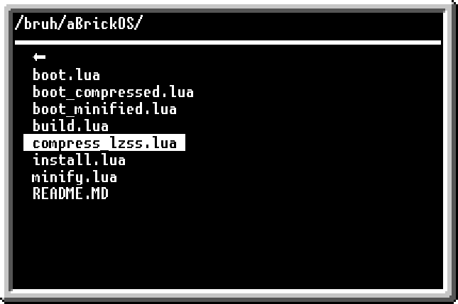
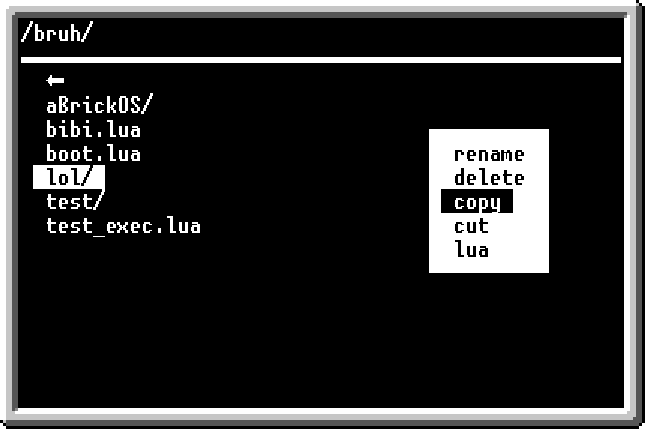
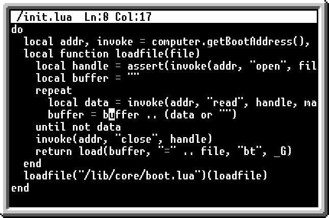
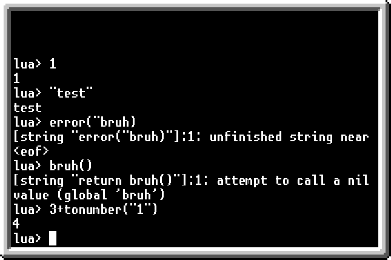

# aBrickOS

## Overview
This is extremely compact operation system for OpenComputers.

Targets to minimal system requirements.

Runs from eeprom.

## Features
+ gui
+ file manager
+ text editor
+ lua interpreter

## Screenshots

## Minimal system requirements
+ cpu t1
+ memory t1
+ eeprom
+ graphic card t1
+ screen t1

## Installation
If you have internet card, just execute `pastebin run HHwNLs39`.

Otherwise you can copy content of `boot_compressed.lua` to your disk and execute `flash -q boot_compressed.lua aBrickOS`

## Usage
For navigate in any menu use [🠕] and [🠗] keys.

Key [🠔] will close menu or step back.

Key [🠖] will apply selected menu item.

Key [≡] will open context menu or close opened context menu.

"⬅" file item meaning back to top level folder.

Context menu of "⬅" has items `new file`,`new folder`,`paste` and `lua`.

Context menu of folder has items "rename","delete","copy","cut" and "lua".

Context menu of file has items "edit","execute","rename","delete","copy","cut" and "lua".

Context menu of editor has items "save" and "close".

For quite from lua interpreter enter ":q".